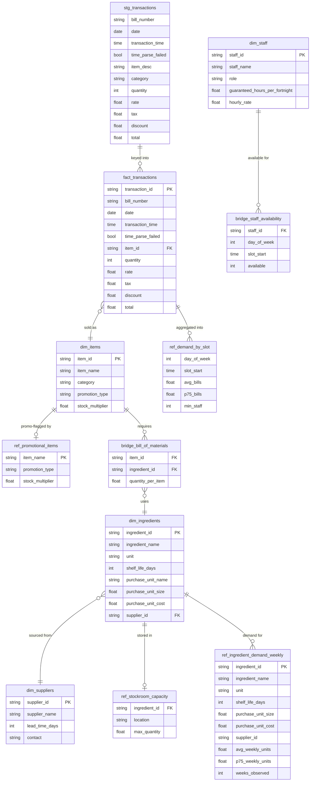

# Data Model

This project turns Cafe Ocean's point-of-sale history into two operational
decisions:

- **Staff planning** — roster staff against per-slot demand at minimum cost.
- **Stock purchasing** — order each ingredient weekly to cover demand within
  storage and shelf-life limits.

Both are driven off the same transaction core (`fact_transactions` + `dim_items`).

## Pipeline layers

```
raw Excel ──load_raw.py──► raw_transactions ──dbt──► staging (views) ──► marts (tables)
                                                                  ▲
                                            manually maintained seeds (dbt seed)
```

- **staging** (`stg_transactions`) — cleaned, typed view over the raw load.
- **marts** — analytical tables consumed by the optimisers.
- **seeds** — manually maintained reference CSVs in `transform/seeds/`.

## Entity Relationship Diagram



Two pairs are **not** joined by a foreign key — they meet inside an optimiser:
`ref_demand_by_slot` × `bridge_staff_availability` on `(day_of_week, slot_start)`
in the staffing model, and `ref_ingredient_demand_weekly` × `ref_stockroom_capacity`
on `ingredient_id` in the stock model.

---

## Core tables

### stg_transactions
**Type:** Staging view, built from `raw_transactions`.
**Grain:** One row per source line item (cleaned and typed).

| Column | Type | Notes |
|---|---|---|
| bill_number | string | Original `Bill Number` field |
| date | date | `CAST(date AS DATE)` |
| transaction_time | time | `TRY_CAST(... AS TIME)`; `NULL` if unparseable |
| time_parse_failed | bool | `true` when the source time could not be cast |
| item_desc | string | Raw product description |
| category | string | Raw product category |
| quantity, rate, tax, discount, total | numeric | Financial fields, passed through |

### fact_transactions
**Type:** Mart, built from `stg_transactions` joined to `dim_items`.
**Grain:** One row per line item per bill.

| Column | Type | Notes |
|---|---|---|
| transaction_id | string | Surrogate key (e.g. `TXN000001`) |
| bill_number | string | Original `Bill Number` field |
| date | date | Transaction date |
| transaction_time | time | Parsed transaction time |
| time_parse_failed | bool | `true` if the source time could not be cast |
| item_id | string | FK to `dim_items`; matched on `item_desc = item_name` |
| quantity | int | Units sold |
| rate | float | Unit price before tax/discount |
| tax | float | Tax amount applied |
| discount | float | Discount amount applied |
| total | float | Final transaction value |

### dim_items
**Type:** Mart, derived from distinct `Item Desc` in `stg_transactions`, left-joined
to `ref_promotional_items`.
**Grain:** One row per unique product sold.

| Column | Type | Notes |
|---|---|---|
| item_id | string | Surrogate key (e.g. `ITM001`) |
| item_name | string | Original `Item Desc` value |
| category | string | Most frequently recorded `Category` for the item |
| promotion_type | string | `1+1` / `2+1` / `BUNDLE` if promotional, else `NULL` |
| stock_multiplier | float | Units of stock consumed per billed unit (promo correction); `NULL` if not promotional |

---

## Staffing model

### ref_demand_by_slot
**Type:** Mart, aggregated from `fact_transactions`.
**Grain:** One row per day-of-week per 30-minute operating slot.

| Column | Type | Notes |
|---|---|---|
| day_of_week | int | DuckDB `DAYOFWEEK`: 0 = Sunday … 6 = Saturday |
| slot_start | time | Start of the 30-minute slot (e.g. `18:30:00`) |
| avg_bills | float | Mean distinct bills observed in the slot |
| p75_bills | float | 75th-percentile bills — the demand estimate used |
| min_staff | int | `ceil(p75_bills / service_rate)`, floored at 1 |

`service_rate` is a dbt variable (`transform/dbt_project.yml`).

### dim_staff
**Type:** Seed. File: `transform/seeds/dim_staff.csv`
**Grain:** One row per staff member.

| Column | Type | Notes |
|---|---|---|
| staff_id | string | Surrogate key (e.g. `STF001`) |
| staff_name | string | Staff member's name |
| role | string | e.g. `manager`, `bartender`, `server` |
| guaranteed_hours_per_fortnight | float | Minimum contracted hours per fortnight |
| hourly_rate | float | Wage rate; drives the optimiser's cost objective |

### bridge_staff_availability
**Type:** Seed. File: `transform/seeds/bridge_staff_availability.csv`
**Grain:** One row per staff member per day-of-week per available slot.

| Column | Type | Notes |
|---|---|---|
| staff_id | string | FK to `dim_staff` |
| day_of_week | int | DuckDB `DAYOFWEEK`: 0 = Sunday … 6 = Saturday |
| slot_start | time | Start of a 30-minute slot the staff member can work |
| available | int | `1` = available (only available slots are stored) |

The `(day_of_week, slot_start)` convention matches `ref_demand_by_slot`, so the
optimiser lines demand up against availability directly. See
[staffing_model.md](staffing_model.md).

---

## Stock purchasing model

### ref_ingredient_demand_weekly
**Type:** Mart, built from `fact_transactions` × `dim_items` × `bridge_bill_of_materials`,
joined to `dim_ingredients`. Applies `stock_multiplier` so promotional items count
the stock actually dispensed, not just the billed quantity.
**Grain:** One row per ingredient.

| Column | Type | Notes |
|---|---|---|
| ingredient_id | string | FK to `dim_ingredients` |
| ingredient_name, unit, shelf_life_days, purchase_unit_name, purchase_unit_size, purchase_unit_cost, supplier_id | — | Carried from `dim_ingredients` |
| avg_weekly_units | float | Mean weekly consumption (ingredient units) |
| p75_weekly_units | float | 75th-percentile weekly consumption — the demand estimate used |
| weeks_observed | int | Number of weeks contributing to the estimate |

### ref_promotional_items
**Type:** Seed. File: `transform/seeds/ref_promotional_items.csv`
**Grain:** One row per promotional item. Joined into `dim_items` on `item_name`.

| Column | Type | Notes |
|---|---|---|
| item_name | string | Matches `dim_items.item_name` |
| promotion_type | string | `1+1`, `2+1`, or `BUNDLE` |
| stock_multiplier | float | Stock units consumed per billed unit |

### dim_ingredients
**Type:** Seed. File: `transform/seeds/dim_ingredients.csv`
**Grain:** One row per raw material or ingredient.

| Column | Type | Notes |
|---|---|---|
| ingredient_id | string | Surrogate key (e.g. `ING001`) |
| ingredient_name | string | e.g. "Full Cream Milk" |
| unit | string | Measurement unit used in the BOM (e.g. `ml`, `g`, `pieces`) |
| shelf_life_days | int | Days before the ingredient expires |
| purchase_unit_name | string | e.g. "Carton 1L", "Case of 24" |
| purchase_unit_size | float | Size of one purchase unit in `unit` (e.g. `1000` for a 1 L carton) |
| purchase_unit_cost | float | Cost per purchase unit |
| supplier_id | string | FK to `dim_suppliers` |

### bridge_bill_of_materials
**Type:** Seed. File: `transform/seeds/bridge_bill_of_materials.csv`
**Grain:** One row per ingredient per item (many-to-many bridge).

| Column | Type | Notes |
|---|---|---|
| item_id | string | FK to `dim_items` |
| ingredient_id | string | FK to `dim_ingredients` |
| quantity_per_item | float | Amount of ingredient used per 1 unit sold (in ingredient `unit`) |

### dim_suppliers
**Type:** Seed. File: `transform/seeds/dim_suppliers.csv`
**Grain:** One row per supplier.

| Column | Type | Notes |
|---|---|---|
| supplier_id | string | Surrogate key (e.g. `SUP001`) |
| supplier_name | string | Supplier business name |
| lead_time_days | int | Days between order and delivery |
| contact | string | Contact name or email |

### ref_stockroom_capacity
**Type:** Seed. File: `transform/seeds/ref_stockroom_capacity.csv`
**Grain:** One row per ingredient per storage location.

| Column | Type | Notes |
|---|---|---|
| ingredient_id | string | FK to `dim_ingredients` |
| location | string | `dry_storage`, `cold_storage`, or `keg_room` |
| max_quantity | float | Maximum storable quantity (in ingredient `unit`) |

See [stock_model.md](stock_model.md).

---

## Data Flow

```
Kaggle Excel
    └── load_raw.py ──► raw_transactions (DuckDB)
            └── stg_transactions (staging view: typed, cleaned)
                    ├── dim_items ◄── ref_promotional_items (seed)
                    └── fact_transactions
                            ├── ref_demand_by_slot ............... STAFFING demand
                            └── ref_ingredient_demand_weekly ..... STOCK demand
                                  (× bridge_bill_of_materials × dim_ingredients)

Seeds (dbt seed)
    Staffing:  dim_staff, bridge_staff_availability
    Stock:     ref_promotional_items, dim_ingredients, bridge_bill_of_materials,
               dim_suppliers, ref_stockroom_capacity
```

**Staffing model** uses:
`ref_demand_by_slot` (demand) + `bridge_staff_availability` (supply) + `dim_staff`
(cost & contracted hours) → roster.

**Stock purchasing model** uses:
`ref_ingredient_demand_weekly` (demand) + `ref_stockroom_capacity` (storage) +
`dim_ingredients` (shelf life, cost, pack size) → weekly purchase order.
