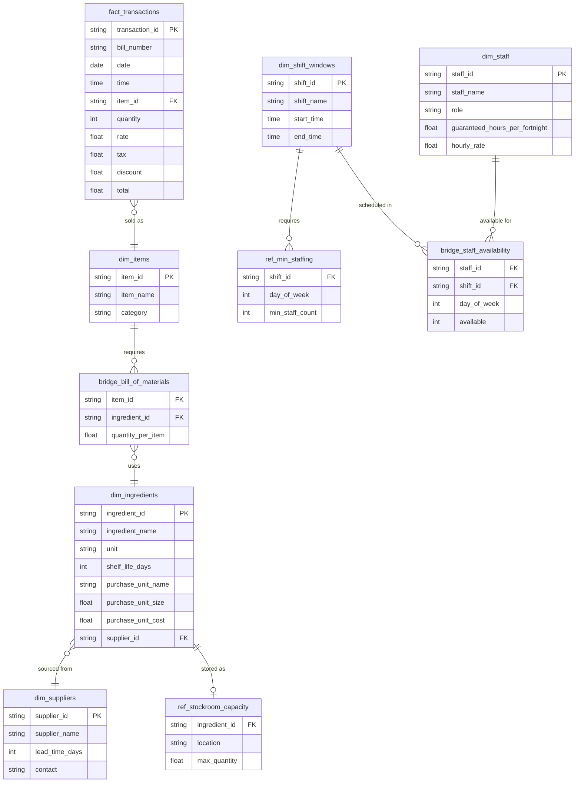

# Data Model

## Entity Relationship Diagram



---

## Table Reference

### fact_transactions
**Source:** Kaggle dataset (primary data)
**Grain:** One row per line item per bill.

| Column | Type | Notes |
|---|---|---|
| transaction_id | string | Surrogate key: `bill_number + "_" + row_index` |
| bill_number | string | Original `Bill Number` field |
| date | date | Transaction date |
| time | time | Transaction time |
| item_id | string | FK to `dim_items`; derived by matching `Item Desc` |
| quantity | int | Units sold |
| rate | float | Unit price before tax/discount |
| tax | float | Tax amount applied |
| discount | float | Discount amount applied |
| total | float | Final transaction value |

---

### dim_items
**Source:** Derived from distinct `Item Desc` values in `fact_transactions`.
**Grain:** One row per unique product sold.

| Column | Type | Notes |
|---|---|---|
| item_id | string | Surrogate key (e.g. `ITM001`) |
| item_name | string | Original `Item Desc` value |
| category | string | Original `Category` value |

---

### dim_ingredients
**Source:** Manually constructed. File: `data/manual/dim_ingredients.csv`
**Grain:** One row per raw material or ingredient.

| Column | Type | Notes |
|---|---|---|
| ingredient_id | string | Surrogate key (e.g. `ING001`) |
| ingredient_name | string | e.g. "Full-cream milk" |
| unit | string | Measurement unit used in BOM (e.g. `ml`, `g`, `each`) |
| shelf_life_days | int | Days before ingredient expires |
| purchase_unit_name | string | e.g. "1L bottle", "1kg bag" |
| purchase_unit_size | float | Size of purchase unit in `unit` (e.g. `1000` for 1000 ml) |
| purchase_unit_cost | float | Cost per purchase unit in local currency |
| supplier_id | string | FK to `dim_suppliers` |

---

### bridge_bill_of_materials
**Source:** Manually constructed. File: `data/manual/bridge_bill_of_materials.csv`
**Grain:** One row per ingredient per item (many-to-many bridge).

| Column | Type | Notes |
|---|---|---|
| item_id | string | FK to `dim_items` |
| ingredient_id | string | FK to `dim_ingredients` |
| quantity_per_item | float | Amount of ingredient used per 1 unit sold (in ingredient `unit`) |

---

### dim_suppliers
**Source:** Manually constructed. File: `data/manual/dim_suppliers.csv`
**Grain:** One row per supplier.

| Column | Type | Notes |
|---|---|---|
| supplier_id | string | Surrogate key (e.g. `SUP001`) |
| supplier_name | string | Supplier business name |
| lead_time_days | int | Days between order and delivery |
| contact | string | Contact name or email |

---

### ref_stockroom_capacity
**Source:** Manually constructed. File: `data/manual/ref_stockroom_capacity.csv`
**Grain:** One row per ingredient per storage location.

| Column | Type | Notes |
|---|---|---|
| ingredient_id | string | FK to `dim_ingredients` |
| location | string | `back_of_house` or `front_of_house` |
| max_quantity | float | Maximum storable quantity (in ingredient `unit`) |

---

### dim_staff
**Source:** Manually constructed. File: `data/manual/dim_staff.csv`
**Grain:** One row per staff member.

| Column | Type | Notes |
|---|---|---|
| staff_id | string | Surrogate key (e.g. `STF001`) |
| staff_name | string | Staff member's name |
| role | string | e.g. `barista`, `cashier`, `supervisor` |
| guaranteed_hours_per_fortnight | float | Minimum contracted hours per fortnight |
| hourly_rate | float | Wage rate (used for budget constraint) |

---

### dim_shift_windows
**Source:** Manually constructed. File: `data/manual/dim_shift_windows.csv`
**Grain:** One row per named shift slot.

| Column | Type | Notes |
|---|---|---|
| shift_id | string | Surrogate key (e.g. `SHF001`) |
| shift_name | string | e.g. `Morning`, `Afternoon`, `Close` |
| start_time | time | Shift start (HH:MM) |
| end_time | time | Shift end (HH:MM) |

---

### ref_min_staffing
**Source:** Manually constructed. File: `data/manual/ref_min_staffing.csv`
**Grain:** One row per shift per day of week. Derived from transaction frequency thresholds.

| Column | Type | Notes |
|---|---|---|
| shift_id | string | FK to `dim_shift_windows` |
| day_of_week | int | 0 = Monday … 6 = Sunday |
| min_staff_count | int | Minimum number of staff required |

---

### bridge_staff_availability
**Source:** Manually constructed. File: `data/manual/bridge_staff_availability.csv`
**Grain:** One row per staff member per shift per day of week.

| Column | Type | Notes |
|---|---|---|
| staff_id | string | FK to `dim_staff` |
| shift_id | string | FK to `dim_shift_windows` |
| day_of_week | int | 0 = Monday … 6 = Sunday |
| available | int | `1` = available, `0` = unavailable |

---

## Data Flow

```
Kaggle Excel
    └── fact_transactions
            └── dim_items (derived from distinct Item Desc)

Manually constructed
    ├── dim_suppliers
    ├── dim_ingredients  ──────────────────────────┐
    ├── bridge_bill_of_materials (items × ingredients)
    ├── ref_stockroom_capacity                     │
    ├── dim_staff                                  │
    ├── dim_shift_windows                          │
    ├── ref_min_staffing (shifts × days)           │
    └── bridge_staff_availability (staff × shifts × days)
```

**Stock purchasing model** uses:
`fact_transactions` → `bridge_bill_of_materials` → `dim_ingredients` → `ref_stockroom_capacity` + `dim_suppliers`

**Staffing model** uses:
`fact_transactions` (demand signal) → `ref_min_staffing` ↔ `bridge_staff_availability` → `dim_staff`
